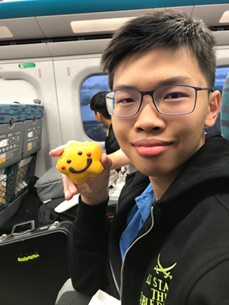

# About Us

We are a team based in the [School of Computing, National University of Singapore](http://www.comp.nus.edu.sg).

## Project team

### Nguyen Huy Tung

* Role: Developer
* Responsibilities: Testing

### Ku Brian

[[github](https://github.com/johndoe)]

* Role: Developer
* Responsibilities: Deliverables and deadlines

### Ernest Ng Zi Xuan

[[github](https://github.com/Ernestnzx)]

* Responsibility: Documentation 

### Jun Rui

[[github](http://github.com/raw-asparagus)]

* Role: DevOps
* Responsibilities: Data
