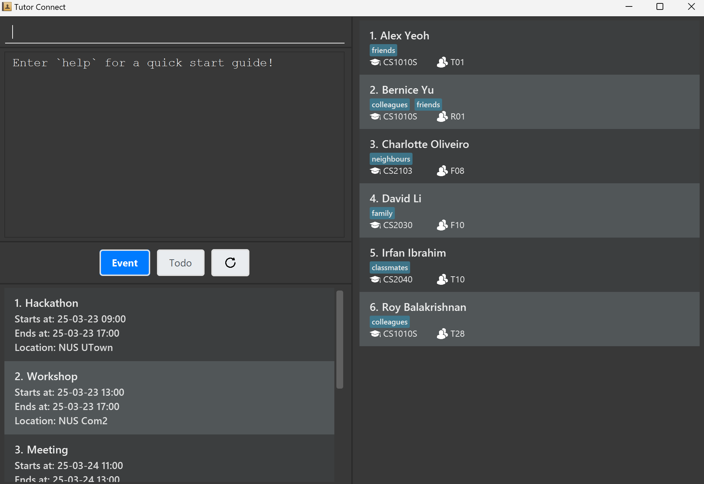

# TutorConnect User Guide

TutorConnect is a **CLI-based student management tool designed for tutors handling multiple courses across different platforms.**
It provides a centralized solution for organizing student contacts and managing tasks—without the complexity of a full-fledged learning management system.
If you can type fast, TutorConnect can get your contact management tasks done faster than traditional GUI apps.

<!-- * Table of Contents -->
<page-nav-print />

--------------------------------------------------------------------------------------------------------------------

## Quick start

1. Ensure you have Java `17` or above installed in your Computer. 
   **Mac users:** Ensure you have the precise JDK version prescribed [here](https://se-education.org/guides/tutorials/javaInstallationMac.html).

1. Download the latest `.jar` file from [here](https://github.com/se-edu/addressbook-level3/releases).

1. Copy the file to the folder you want to use as the _home folder_ for your TutorConnect.

1. Open a command terminal, `cd` into the folder you put the jar file in, and use the `java -jar addressbook.jar` command to run the application. 
   A GUI similar to the below should appear in a few seconds. Note how the app contains some sample data. 
   

1. Type the command in the command box and press Enter to execute it. e.g. typing **`help`** and pressing Enter will open the help window. 
   Some example commands you can try:

    * `list` : Lists all contacts.

    * `add n/John Doe p/98765432 e/johnd@example.com a/John street, block 123, #01-01` : Adds a contact named `John Doe` to the Address Book.

    * `delete 3` : Deletes the 3rd contact shown in the current list.

    * `clear` : Deletes all contacts.

    * `exit` : Exits the app.

1. Refer to the [Features](#features) below for details of each command.

--------------------------------------------------------------------------------------------------------------------

## Features

<box type="info" seamless>

**Notes about the command format:** 

* Commands working with item will be of format `ITEM COMMAND PARAMETERS`.

* Words in `UPPER_CASE` are the parameters to be supplied by the user. 
  e.g. in `add --name NAME`, `NAME` is a parameter which can be used as `add --name John Doe`.

* Parameters in square brackets are optional. 
  e.g `--name NAME [--tag TAG(S)]` can be used as `--name John Doe --tag friend`, `--name John Doe`, or `--name John Doe --tag enemy must-be-destroyed`.

* Parameters with optional plural markers can be specified a positive integer number of times.
  Note that this rule can be combined with the previous one to represent a parameter that can be specified a non-negative integer number of times. 
  e.g. `--contact CONTACT_INDEX/INDICES` can be used as `--contact 123` or `--contact 4 5 6`.

* Parameters can be in any order. 
  e.g. if the command specifies `--name NAME --location LOCATION`, `--location LOCATION --name NAME ` is also acceptable.

* Extraneous parameters for commands that do not take in parameters (such as `todo list`, `exit` and `event clear`) will be ignored. 
  e.g. if the command specifies `todo list 123`, it will be interpreted as `todo list`.

* Constraints for common parameters:
    * Most text-based parameters can accept multiple words as values, but the words cannot start with a `-` to avoid clashing with our prefixes. This applies to `NAME`, `ID`, `COURSE`, `GROUP`, and `LOCATION`.
      e.g. `NUS Science`, `E.T. the Extra-Terrestrial`, `#?!@-*#$` are acceptable, but `1 - 1 = 2` is not.
    * Datetime-based parameters must be of format `YY-MM-DD HH:MM`, with exactly one space between `DD` and `HH`, and where `HH` is in the 24-hour format.
    * `TAG` parameters must be a single word not starting with `-`.
    * Index-based parameters must be a positive integer not larger than the size of the list of interest.

* If you are using a PDF version of this document, be careful when copying and pasting commands that span multiple lines as space characters surrounding line-breaks may be omitted when copied over to the application.
  </box>

## Event: `event`

### Adding an event: `add`
Adds an event to the address book.

Format: `event add --name NAME --start START_DATETIME --end END_DATETIME --location LOCATION [--tag TAG(S)]`

**Important:** start time and end time format is `YY-MM-DD HH:MM`, where `HH` is in 24 hour format and start time must be earlier than end time.

**Tip:** An event can have any number of tags (including 0)

Examples:
* `event add --name CS2040S tutorial --start 24-08-26 12:00 --end 24-08-26 14:00 --location NUS SoC COM1 --tag algorithms`
* `event add --name CS1010S tutorial --start 25-01-31 14:00 --end 25-01-31 18:00 --location NUS BIZ2 --tag tut29 tut30`

### Editing an event: `edit`
Edits the details of the event identified by the index number in the currently displayed event list. Only the fields specified in the command will be updated; all others remain unchanged.

Format:
`event edit INDEX [--name NAME] [--start START_TIME] [--end END_TIME] [--location LOCATION] [--contact CONTACT_INDEX/INDICES] [--tag TAG(S)]`

* `INDEX` refers to the event to be edited, based on its position in the displayed event list.

* Fields that are not included in the command will remain unchanged. You can update any combination of fields at once. At least 1 field should be edited.

* If `--tag` is provided with no value, all tags will be cleared.

Important:

* `INDEX` must be a positive integer.

* `CONTACT_INDEX/INDICES` refers to the index(es) in the contact list currently displayed on the right.

Examples:

* `event edit 1 --name Project Meeting`

* `event edit 2 --start 25-03-15 10:00 --end 25-03-15 12:00`

* `event edit 3 --location COM2-0208 --tag project`

* `event edit 4 --contact 1 2 3`

### Deleting an event: `delete`

Deletes the event identified by the index number used in the displayed event list.

Format: `event delete INDEX`

Example:
* `event delete 1`

### Displaying information of event: `info`
Displays the complete information belonging to the event identified by the index number used in the displayed event list.

Format: `event info INDEX`

Example:
* `event info 1`

### Clearing event list: `clear`
Clears the event list.

Format: `event clear`

### Linking contacts: `link`
Associates one or more contacts to an event. Useful for keeping track of which contacts are involved in a particular event.

Format: `event link INDEX --contact CONTACT_INDEX/INDICES`

* `INDEX` refers to the index of the event in the displayed event list.

* `CONTACT_INDEX/INDICES` refers to the index(es) of the contact(s) in the currently displayed contact list.

* You can link multiple contacts by providing more than one contact index.

* At least one `CONTACT_INDEX` must be provided.

Examples:
* `event link 1 --contact 1 3 4`

### Unlinking contacts: `unlink`
Removes the association between one or more contacts and a specific event.

Format: `event unlink EVENT_INDEX --contact CONTACT_INDEX/INDICES`

* `EVENT_INDEX` refers to the index of the event in the displayed event list.

* `CONTACT_INDEX/INDICES` refers to the index(es) of the contact(s) to be unlinked from the event.

* You can unlink multiple contacts by providing more than one contact index.

Examples:
* `event unlink 1 --contact 3 4`

### Tagging an event: `tag`
Adds one or more tags to the specified event. Tags help categorize and filter events more easily (e.g., by priority, role, type, etc.).

Format: `event tag EVENT_INDEX --tag TAG(S)`

* `EVENT_INDEX` refers to the index of the event in the currently displayed event list.

* You can add one or more tags by listing them after `--tag`.

* Duplicate tags (already added to the event) are not allowed.

* Tags are case-sensitive and stored as-is.

Example:
* `event tag 1 --tag TA Important`

### Untagging an event: `untag`
Removes one or more tags from the specified event. Useful for decluttering or updating tag information as event details change.

Format: `event untag EVENT_INDEX --tag TAG(S)`

* `EVENT_INDEX` refers to the index of the event in the currently displayed event list.

* You can remove one or more tags by listing them after `--tag`.

* Tags are case-sensitive and must match the tag(s) assigned to the event.

**Important**: `EVENT_INDEX` must be a positive integer.

Example:
* `event untag 1 --tag important weekly`

### Logging attendance for an event: `log`
Records the attendance of one or more contacts for a specific event. This allows you to track who actually attended, separate from just being linked to the event.

Format: `event log EVENT_INDEX --contact CONTACT_INDEX [CONTACT_INDEX/INDICES]`

* `EVENT_INDEX` refers to the index of the event in the displayed event list.

* `CONTACT_INDEX/INDICES` refers to the index(es) of the contacts linked to the event, as shown by event info.

* You can log multiple contacts at once by listing their indices.

* You cannot unlog a contact that is already unlogged.

**Tip:** Use event info to view the current linked contacts and their indices.

Example:
* `event log 1 --contact 1 2 3`
  (Logs attendance for contacts 1, 2, and 3 at the event with index 1)

### Removing attendance logs from an event: `unlog`
Removes the attendance logs of one or more contacts from a specific event. Useful for correcting mistakes or updating attendance records.

Format:
`event unlog EVENT_INDEX --contact CONTACT_INDEX [CONTACT_INDEX/INCIDES]`

* `EVENT_INDEX` refers to the index of the event in the displayed event list.

* `CONTACT_INDEX/INDICES` refers to the index(es) of the contacts previously logged for that event, as shown in event info.

* You can unlog multiple contacts at once by listing their indices.

* You cannot unlog a contact that is already unlogged

**Important:** EVENT_INDEX must be a positive integer.

**Tip:** Use event info to view currently logged contacts and their indices.

Example:
`event unlog 1 --contact 1 2 3`
(Removes attendance logs for contacts 1, 2, and 3 from the event with index 1)

### Filtering events: `filter`
Filters the list of events based on one or more criteria. You can search by event name, time, location, tags, or linked contacts using logical operators to combine multiple values.

Format:
`event filter --<COLUMN> [<OPERATOR>:] <VALUE(S)> [...]`

Supported columns:
* `--name`: Event name.
* `--start`: Start time.
* `--end`: End time.
* `--location`: Event location.
* `--tag`: Tags.
* `--contact`: Linked contacts.

Operators (optional):
* `and` (default): All values must match.
* `or`: At least one value must match.
* `nand`: None of the values must match.
* `nor`: Reject all values.

If an operator is not provided, it defaults to `and`.

**Value formats**:

Name, Location and Tag:
* Provide one or more keywords separated by spaces.
* Keywords are case-insensitive and support partial matches.

Start & End Time:
* Provide one or more closed intervals, each written as: `[<INTERVAL_START>/<INTERVAL_END>]`.
* Each datetime must follow the format: `YY-MM-DD HH:MM`.
* At least one of the two bounds must be specified. You can replace an empty bounds using `-`.

Contact:
* Provide contact indices (as shown in the current contact list).

* Matches events linked to all the specified contacts (default `and`, unless overridden).

Examples:
* `event filter --name or: Exam PRESENTATION`.
    * Find todos whose name contains at least one of the keywords "exam" or "presentation."

* `event filter --name CS1010S eXAM --start or: [25-03-13 23:59/25-03-20 23:59] [25-03-27 23:59/-]`
    * Find todos whose name contains both the keywords `"CS1010S"` and `"exam"` and whose start time is between `25-03-13 23:59` and `25-03-20 23:59`(inclusive) or after `25-03-27 23:59` (inclusive).

* `event filter --location nand: NUS Home --contact 1 2 3`
    * Find todos whose location does not contain the keywords "NUS" or "home" and which are is linked to the people currently at index 1, 2 and 3.

## Todo: `todo`

A todo is a task with a deadline that can be associated with multiple contacts to indicate their involvement. It supports the following commands.

### Adding a todo: `add`
Adds a todo to the app.

Format: `todo add --name NAME --location LOCATION --deadline DEADLINE [--tag TAG(S)]`

**Tip:** A todo can have any number of tags (including 0)

Examples:
* `todo add --name Final Submission --deadline 24-08-26 12:00 --location NUS SoC COM1 --tag CS1234`
* `todo add --name CS1010S mission --deadline 24-05-26 12:00 --location Coursemology --tag urgent struggling`

### Editing an todo: `edit`
Edits the details of the todo identified by the index number in the currently displayed todo list. Only the fields specified in the command will be updated; all others remain unchanged.

Format:
`event edit INDEX [--name NAME] [--deadline DEADLINE] [--location LOCATION] [--status STATUS] [--contact CONTACT_INDEX/INDICES] [--tag TAG(S)]`

* `INDEX` refers to the todo to be edited, based on its position in the displayed todo list.

* `STATUS` can only be `true` or `false`.

* `CONTACT_INDEX/INDICES` refers to the index(es) of the contact(s) in the currently displayed contact list, which will be linked to the todo.

* Fields that are not included in the command will remain unchanged. You can update any combination of fields at once. At least 1 field should be edited.

* If `--tag` is provided with no value, all tags will be cleared.

Examples:

* `todo edit 1 --name Project Meeting`

* `todo edit 2 --deadline 25-03-15 10:00 --location COM2-0208 --tag`

* `todo edit 4 --name Training --contact 1 2 3`

### Deleting a todo: `delete`

Deletes the todo identified by the index number used in the displayed todo list.

Format: `todo delete INDEX`

Example:
* `todo delete 1`

### Displaying information of todo: `info`
Displays the complete information belonging to the todo identified by the index number used in the displayed todo list.

Format: `todo info INDEX`

Example:
* `todo info 1`

### Clearing todo list: `clear`
Clears the todo list.

Format: `todo clear`

### Linking contacts: `link`
Associates one or more contacts to a todo. Useful for keeping track of which contacts are involved in a particular todo.

Format: `todo link TODO_INDEX --contact CONTACT_INDEX/INDICES`

* `TODO_INDEX` refers to the todo of the event in the displayed todo list.

* `CONTACT_INDEX/INDICES` refers to the index(es) of the contact(s) in the currently displayed contact list. You can link multiple contacts by providing more than one contact index.

Examples:
* `todo link 1 --contact 1 3 4`

### Unlinking contacts: `unlink`
Removes the association between one or more contacts and a specific todo.

Format: `todo unlink TODO_INDEX --contact CONTACT_INDEX/INDICES`

* `TODO_INDEX` refers to the index of the todo in the displayed event todo.

* `CONTACT_INDEX/INDICES` refers to the index(es) of the contact(s) to be unlinked from the event based on the list displayed by the `info` command. You can unlink multiple contacts by providing more than one contact index.

Examples:
* `todo unlink 1 --contact 3 4`

### Tagging a todo: `tag`
Adds one or more tags to the specified todo. Tags help categorize and filter todos more easily (e.g., by priority, role, type, etc.).

Format: `todo tag INDEX --tag TAG(S)`

* `INDEX` refers to the index of the todo in the currently displayed todo list.

* Duplicate tags (already added to the todo) are not allowed.

Example:
* `todo tag 1 --tag important need-help`

### Untagging a todo: `untag`
Removes one or more tags from the specified todo.

Format: `event untag INDEX --tag TAG(S)`

* `INDEX` refers to the index of the todo in the currently displayed todo list.

* Tags are case-sensitive and must match the tag(s) assigned to the todo.

Example:
* `todo untag 1 --tag important weekly`

### Mark a todo as done: `mark`
Mark a todo as completed.

Format: `todo mark INDEX`

* `INDEX` refers to the index of the todo in the displayed todo list.

* The todo must not be already marked as done.

Example:
* `todo mark 1`

### Mark a todo as not done: `unmark`
Mark a todo as not done. This reverses the effect of the `mark` command.

Format: `todo unmark INDEX`

* `INDEX` refers to the index of the todo in the displayed todo list.

* The todo must not be already marked as not done.

Example:
`todo unmark 20`

### Filtering todos: `filter`
Filters the list of todos based on one or more criteria. You can search by todos name, time, location, tags, or linked contacts using logical operators to combine multiple values.

Format:
`todo filter --COLUMN OPERATOR: VALUE(S) [...]`

Supported columns:
* `--name`: Todo name.
* `--deadline`: Todo deadline.
* `--location`: Todo location.
* `--status`: Todo status
* `--tag`: Tags.
* `--contact`: Linked contacts.

Operators (optional):
* `and` (default): All values must match.
* `or`: At least one value must match.
* `nand`: None of the values must match.
* `nor`: Reject all values.

If an operator is not provided, it defaults to `and`. If an unrecognized operator is provided, it will be treated as a value. If multiple valid operators are provided, the first one will be applied and the rest will be treated as values.

**Value formats**:

Name, Location, and Tags:
* Provide one or more keywords separated by spaces.
* Keywords are case-insensitive and support partial matches.

DEADLINE:
* Provide one or more closed intervals, each written as: `[<INTERVAL_START>/<INTERVAL_END>]`.
* Each datetime must follow the format: `YY-MM-DD HH:MM`.
* You can use `-` to replace the `START` or the `END` to signify no lower/upper bound. At least one of the two bounds must be specified.

Contact:
* Provide contact indices (as shown in the current contact list).

Examples:
* `todo filter --name or: Exam REPORT`.
    * Find todos whose name contains at least one of the keywords "exam" or "report."

* `todo filter --name CS1010S grading --deadline or: [25-04-13 23:59/25-04-20 23:59] [25-04-27 23:59/-]`
    * Find todos whose name contains both the keywords `"CS1010S"` and `"grading"` and whose start time is between `25-04-13 23:59` and `25-04-20 23:59`(inclusive) or after `25-04-27 23:59` (inclusive).

* `todo filter --location nand: NUS Science --contact 1 2 3`
    * Find todos whose location does not contain the keywords "NUS" or "Science" and which are linked to the people currently at index 1, 2 and 3.

## Miscellaneous

### Listing all subcommands of a feature: `help`

Lists all subcommands of a feature.

Format: `help FEATURE`

Examples:
* `help contact` shows all subcommands of contact feature.
* `help todo` shows all subcommands of todo feature.
* `help event` shows all subcommands of event feature.

### Listing help message of a subcommand of a feature: `help`

Lists help message of a subcommand of a feature.

Format: `help FEATURE SUBCOMMAND`

Examples:
* `help contact add` shows help message of `contact add` command.
* `help todo mark` shows help message of `todo mark` command.
* `help event log` show help message of `event log` command.

### Exiting the program : `exit`/`quit`/`kill`/`bye`

--------------------------------------------------------------------------------------------------------------------

## FAQ

**Q**: How do I transfer my data to another Computer? 
**A**: Install the app in the other computer and overwrite the empty data file it creates with the file that contains the data of your previous AddressBook home folder.

--------------------------------------------------------------------------------------------------------------------

## Known issues

1. **When using multiple screens**, if you move the application to a secondary screen, and later switch to using only the primary screen, the GUI will open off-screen. The remedy is to delete the `preferences.json` file created by the application before running the application again.

--------------------------------------------------------------------------------------------------------------------
